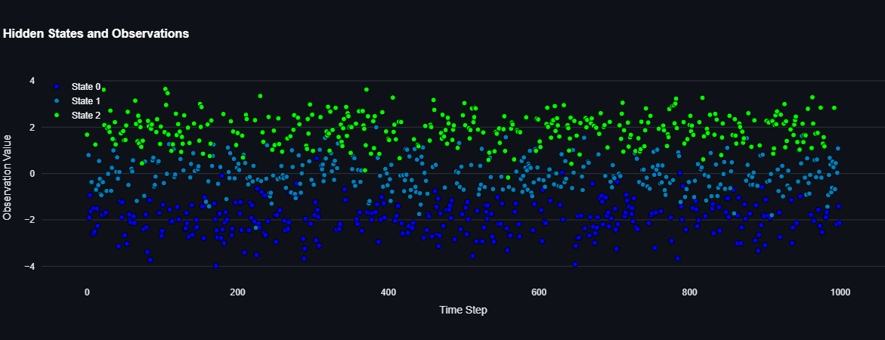
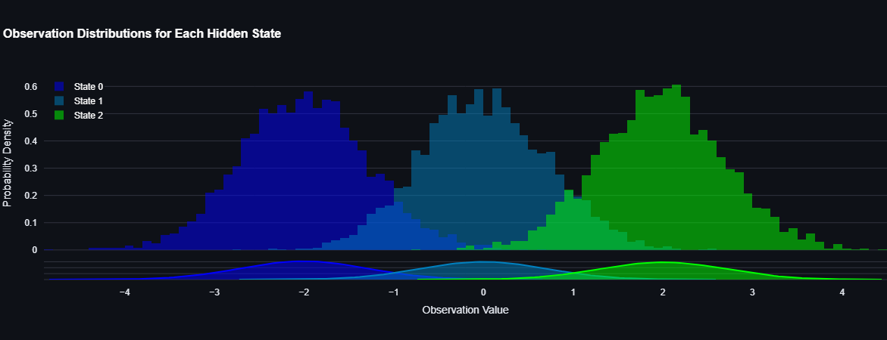
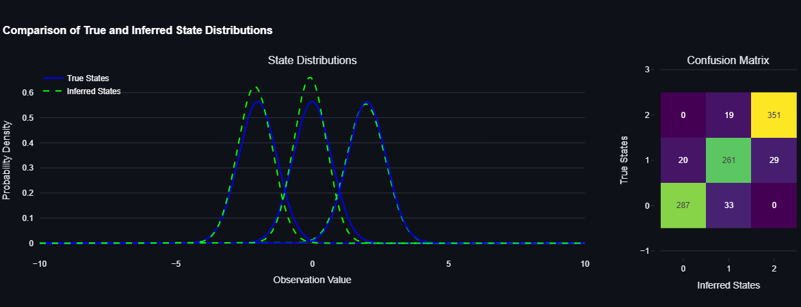
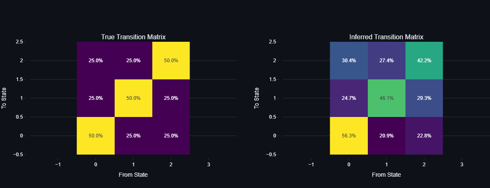

# Hidden Markov Model (HMM) Simulator

## Overview
This project is an interactive educational tool built using **Streamlit** to simulate, train, and evaluate **Hidden Markov Models (HMMs)**. It allows users to generate synthetic data, train an HMM on that data, and assess the model's performance by comparing inferred hidden states with true hidden states. The tool is designed for learning and experimentation, making it ideal for students, researchers, and practitioners interested in probabilistic modeling.

---

## Features
1. **Synthetic Data Generation**:
   - Generate time-series data with user-defined parameters such as the number of hidden states, transition probabilities, and emission distributions.
   - Visualize the generated data as a time series and histograms of observations for each hidden state.

2. **HMM Training**:
   - Train an HMM using the `hmmlearn` library.
   - Specify training parameters like the number of iterations and covariance type.

3. **Model Evaluation**:
   - Compare the true hidden states with the inferred hidden states to calculate accuracy.
   - Visualize the learned vs. true emission distributions.

4. **Interactive Interface**:
   - Use Streamlit's interactive widgets to adjust parameters and visualize results dynamically.

---

## Installation

### Steps
1. Clone the repository:
   ```bash
   git clone https://github.com/yourusername/hmm-simulator.git
   cd hmm-simulator
   ```

2. Install dependencies:
   ```bash
   pip install -r requirements.txt
   ```

3. Run the app:
   ```bash
   streamlit run app.py
   ```

4. Open the app in your browser at `http://localhost:8501`.

---

## Usage

### Step 1: Generate Synthetic Data
- Use the sidebar to set parameters such as:
  - Number of hidden states (`N`)
  - Number of time steps (`T`)
  - Transition probabilities (`p_same`)
  - Emission distribution parameters (mean and variance)
- Click "Generate Data" to create synthetic data and visualize it.

### Step 2: Train HMM
- Set training parameters in the sidebar:
  - Number of iterations
  - Covariance type (`full`, `spherical`, `diag`, `tied`)
- Click "Train HMM" to train the model and visualize the results.

### Step 3: Evaluate Performance
- View the accuracy of the inferred hidden states compared to the true hidden states.
- Compare the true and inferred emission distributions.

---

## Example Workflow
1. Generate synthetic data with `N=3` hidden states, and `T=10000` time steps.
2. Set $A_{ii}=0.5$, $\mu_\text{max} = 2$, and $\sigma^2 = 0.5$.
3. Train the HMM with `n_iter=500` and `covariance_type="full"`.
4. Evaluate the accuracy and inspect the learned distributions.
### Time series data


### Emission distributions for each hidden state 


### Inferred emission distributions and confusion matrix


### True transition matrix and inferred transition matrix

---

## Dependencies
- `streamlit`: For building the interactive web app.
- `numpy`: For numerical computations.
- `plotly`: For interactive visualizations.
- `scipy`: For statistical functions.
- `matplotlib`: For color maps.
- `hmmlearn`: For implementing Hidden Markov Models.
- `scikit-learn`: For confusion matrix.

---

## Contributing
Contributions are welcome! If you'd like to improve this project, please:
1. Fork the repository.
2. Create a new branch for your feature or bug fix.
3. Submit a pull request with a detailed description of your changes.